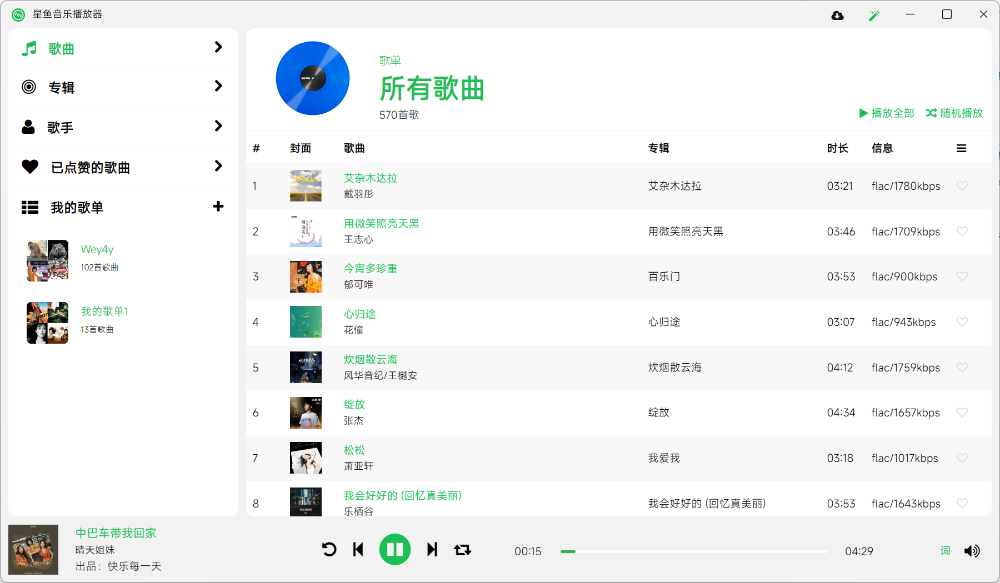

# 星鱼音乐播放器 StarfishPlayer

本项目是个人兴趣爱好开发的基础音乐播放器（非专业级别，勿喷），期望实现基本的音乐播放器功能和基础的使用体验，目前支持Subsonic和Navidrome两种音乐服务（subsonic api）的播放

项目基于Electron（学习中），前端采用Vue

如您在使用过程中遇到的任何问题，欢迎提issue（目前唯一途径）

## 兼容音乐服务
- [x] Subsonic (适配中)
- [x] Navidrome (适配中/Subsonic Api)
- [ ] Audio Station (未来可期待的日子里) 
- [ ] Plex  (未来可期待的日子里)
- [ ] Jellyfin  (未来可期待的日子里)
- [ ] Emby  (未来可期待的日子里)

## 平台
- [x] Windows（开发中）
- [ ] Linux （兼容打包，未测试）
- [ ] MacOS（兼容打包，未测试）

## 功能
- [x] 基本播放
- [X] 歌单/歌曲/专辑/艺人基本操作
- [ ] 桌面歌词

## 支持和引用
歌词对接，兼容 [LrcApi](https://github.com/HisAtri/LrcApi)

右键托盘菜单 - 设置 配置歌词接口,随后重启播放器

## 版本
 - 0.2.1 (beta/此版本可能会存在很多问题)

## 预览

