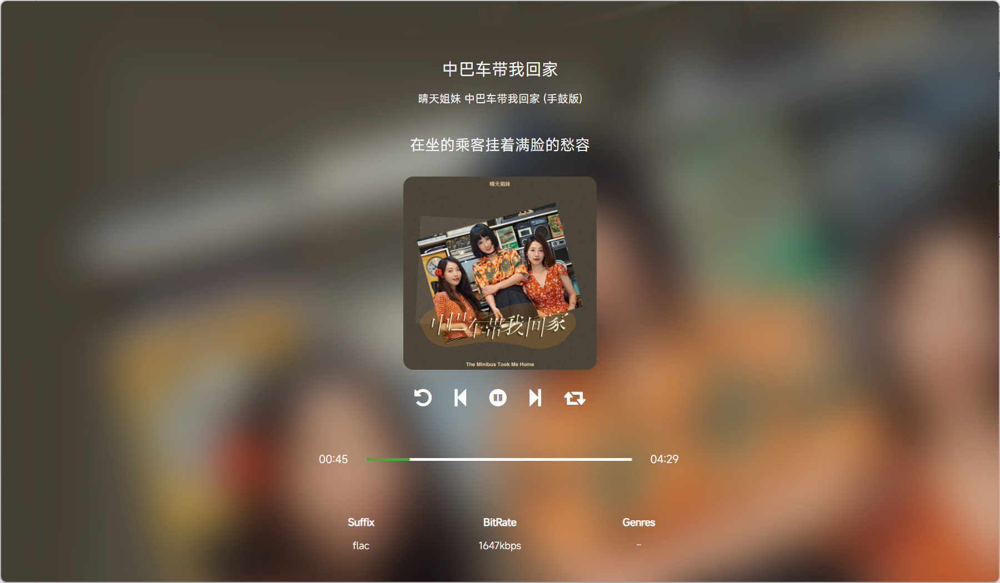
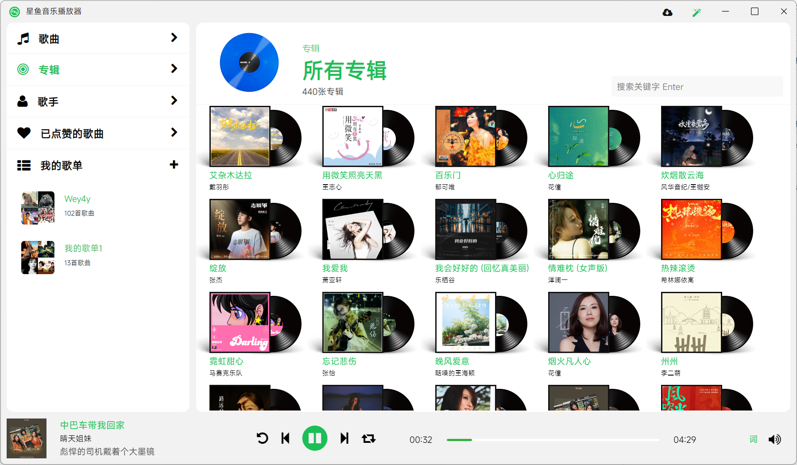

# 开发日常

这里可能会讲的都是一些废话O(∩_∩)O

## 2024/06/05
#### 关于歌词
由于subsonicapi的歌词接口并不友好，所以采用了[LrcApi](https://github.com/HisAtri/LrcApi)来获取歌词，如果你想使用的话，需要自行部署一套LrcApi服务，并完成相应参数的填入。
#### 全屏播放界面
完成了全屏播放界面（自己还算满意，进度条暂缺）

#### 桌面歌词
桌面歌词感觉挺复杂，还需要考虑字体、样式的自定义，目前只是实现了开关显示、同步显示、位置移动

## 2024/06/01
#### 关于播放器
本来是因为兴趣爱好听歌，NAS 部署的audio station和navidrome都没有很好的或者说符合我自己习惯的客户端（仅限于我自己的感受），所以自己决定尝试写一个，反正也无聊，仓库是2024-05-06 建立的初始化，到今天也快一个月了

期间断断续续的写，一边学习Electron 一边开发，当然期间也遇到了一开始i/o操作使用过多产生了主进程阻塞，播放器持续播放一段时间就会产生卡顿的问题，所以期间还把主要流程又重构了一遍。

#### 目前的一些界面
白色主题

黑色主题

专辑
